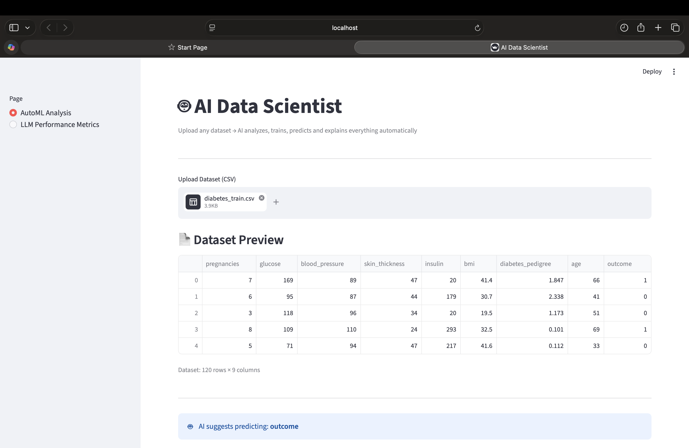
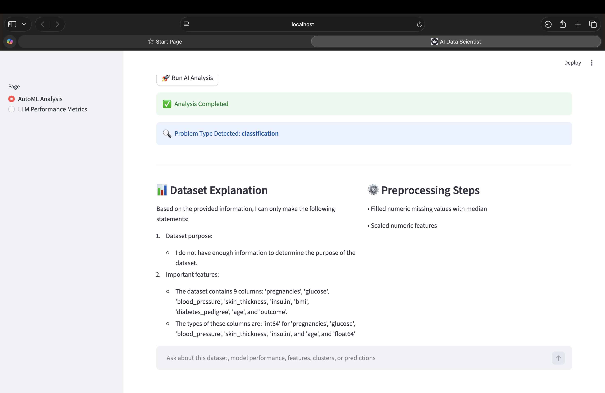
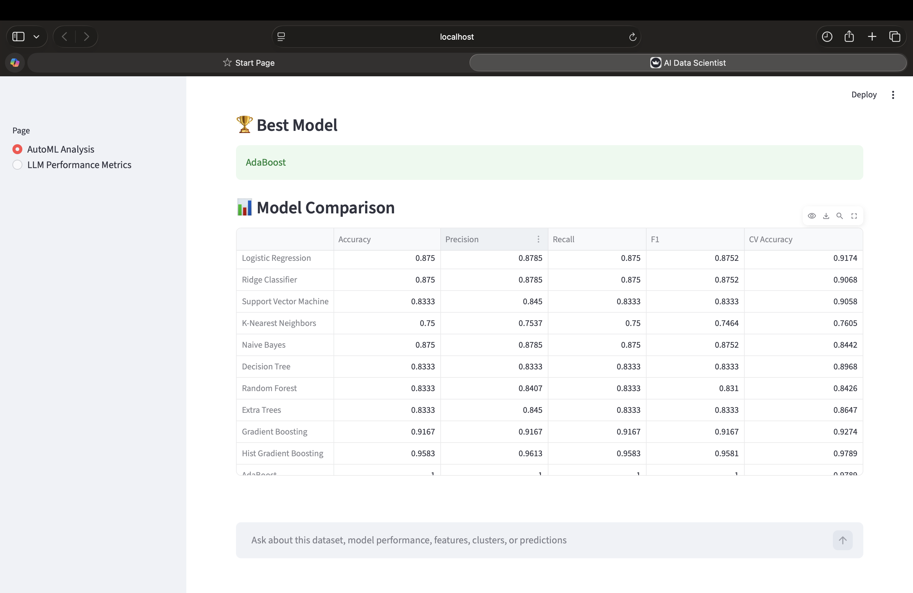
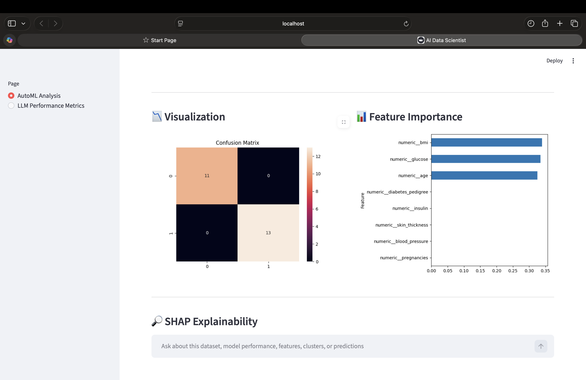
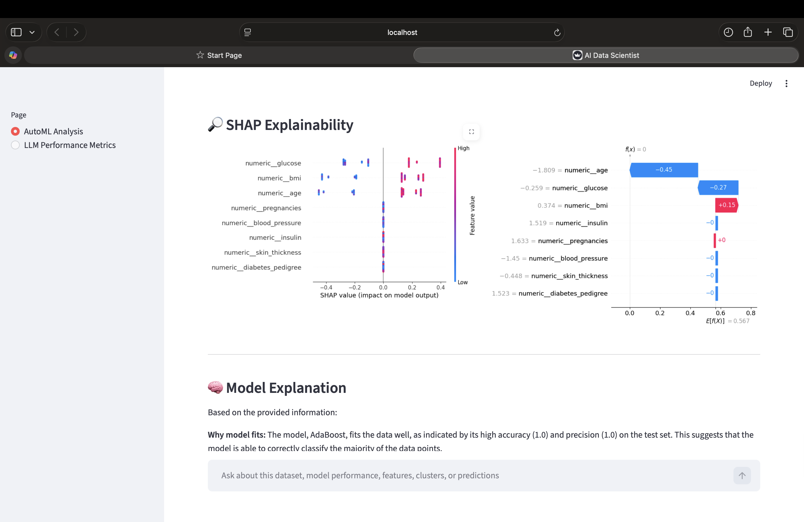
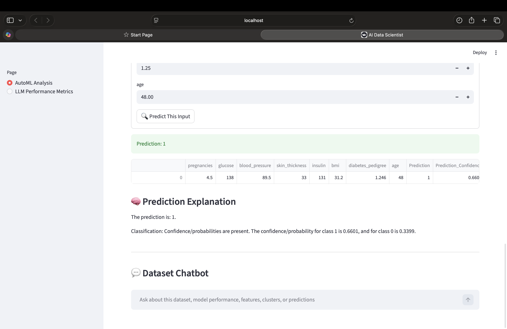
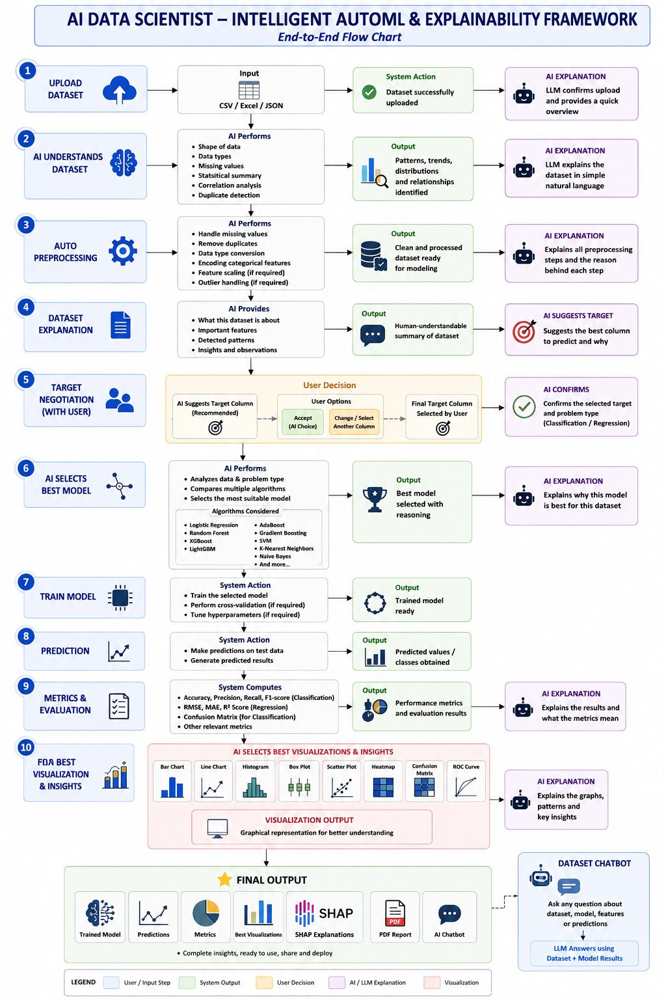

# AI Data Scientist – Intelligent AutoML & Explainability Framework

[](https://www.python.org/)
[](https://streamlit.io/)
[](https://scikit-learn.org/)
[](https://shap.readthedocs.io/)
[](LICENSE)
[](#live-demo)

An end-to-end AutoML platform that analyzes datasets, detects the problem type, trains multiple machine learning models, selects the best model, explains predictions using SHAP, generates visualizations, creates PDF reports, and provides an AI-powered dataset chatbot.

---

## Live Demo

The project is ready for deployment on Streamlit Community Cloud.

```text
Live demo URL: Coming soon
```

After deployment, replace the badge URL with the live Streamlit app link.

---

## Project Demo

### 1. Dataset Upload and Preview



### 2. AI Dataset Analysis



### 3. Model Comparison and Best Model Selection



### 4. Visualizations and Feature Importance



### 5. SHAP Explainability



### 6. Prediction and Explanation



---

## Results

Demo dataset: diabetes classification

| Metric | Value |
| --- | --- |
| Best Model | AdaBoost |
| Accuracy | 100% |
| Precision | 1.00 |
| Recall | 1.00 |
| F1 Score | 1.00 |
| Prediction Confidence | 66.01% |

---

## Architecture



### End-to-End Flow

| Step | System Capability | Output |
| --- | --- | --- |
| 1 | Upload CSV dataset | Dataset preview and schema summary |
| 2 | Understand dataset | Shape, data types, missing values, correlation insights, and duplicate checks |
| 3 | Preprocess data | Clean, encoded, scaled, model-ready dataset |
| 4 | Explain dataset | Human-readable dataset summary |
| 5 | Suggest target | Recommended target column and problem type |
| 6 | Select best model | Model comparison across multiple algorithms |
| 7 | Train model | Final trained model ready for prediction |
| 8 | Predict | Predicted class or value with confidence |
| 9 | Evaluate | Accuracy, precision, recall, F1, confusion matrix, and other metrics |
| 10 | Explain and report | SHAP plots, visual insights, PDF report, and chatbot answers |

---

## Features

| Category | Capability |
| --- | --- |
| Data Understanding | Upload CSV files, preview datasets, inspect rows and columns, and automatically suggest a target column. |
| AutoML | Detect classification or regression problems, preprocess data, train multiple models, and compare performance metrics. |
| Model Selection | Select the best model using validation scores and display model comparison results. |
| Explainability | Generate feature importance, SHAP summary plots, SHAP waterfall explanations, and natural-language model explanations. |
| Prediction | Enter custom feature values, generate predictions, show confidence scores, and explain prediction results. |
| AI Assistant | Ask dataset, model, feature, performance, and prediction questions through an integrated chatbot. |
| Reporting | Generate a PDF report with model results, visualizations, and explainability outputs. |

---

## Tech Stack

- Python
- Streamlit
- Pandas and NumPy
- Scikit-learn
- FLAML
- XGBoost
- LightGBM
- SHAP
- Plotly, Matplotlib, and Seaborn
- Groq API for LLM-powered explanations
- ReportLab for PDF report generation

---

## Project Structure

```text
automl/
|-- app.py
|-- data_preprocess.py
|-- llm_explainer.py
|-- ml_pipeline.py
|-- model_selector.py
|-- report_generator.py
|-- visualizer.py
|-- requirements.txt
|-- Dockerfile
|-- deployment.yaml
|-- service.yaml
|-- screenshots/
|   |-- 01_home.png
|   |-- 02_analysis.png
|   |-- 03_model_comparison.png
|   |-- 04_visualization.png
|   |-- 05_shap_explainability.png
|   |-- 06_prediction.png
```

---

## Installation

Clone the repository:

```bash
git clone https://github.com/sharan1304/automl.git
cd automl
```

Create and activate a virtual environment:

```bash
python -m venv venv
source venv/bin/activate
```

Install dependencies:

```bash
pip install -r requirements.txt
```

Create a `.env` file for the LLM features:

```bash
GROQ_API_KEY=your_groq_api_key
```

Run the Streamlit app:

```bash
streamlit run app.py
```

---

## Recommended GitHub Topics

```text
automl
machine-learning
streamlit
python
data-science
shap
xgboost
flaml
explainable-ai
```

---

## Future Improvements

- Deploy the app on Streamlit Community Cloud and update the live demo badge.
- Add experiment tracking for previous runs.
- Add support for Excel and Parquet uploads.
- Add model export and reload controls from the UI.
- Add more advanced LLM evaluation metrics.

---

## Author

**Sharan**

GitHub: [sharan1304](https://github.com/sharan1304)
